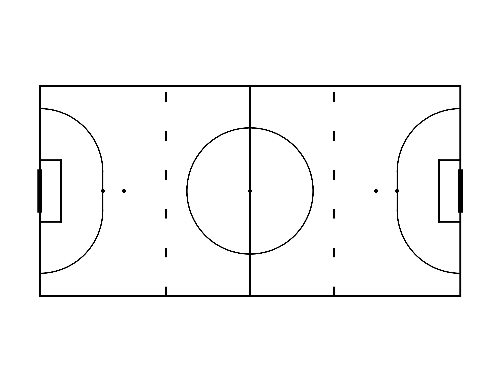
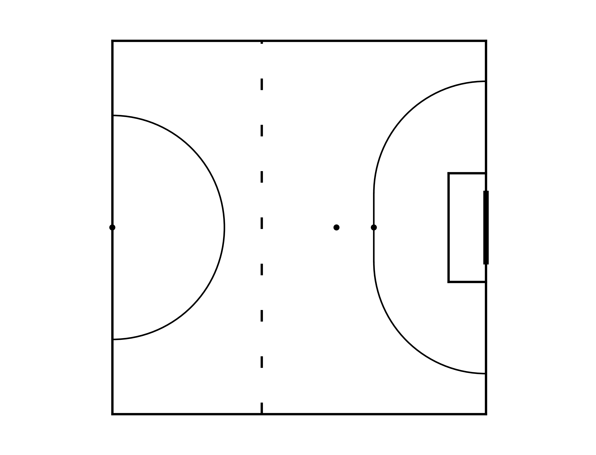
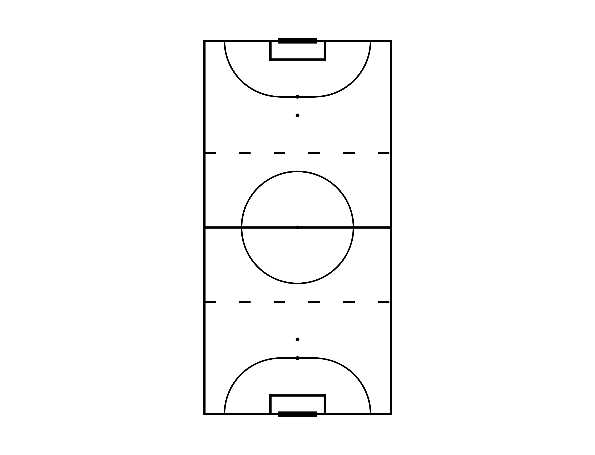
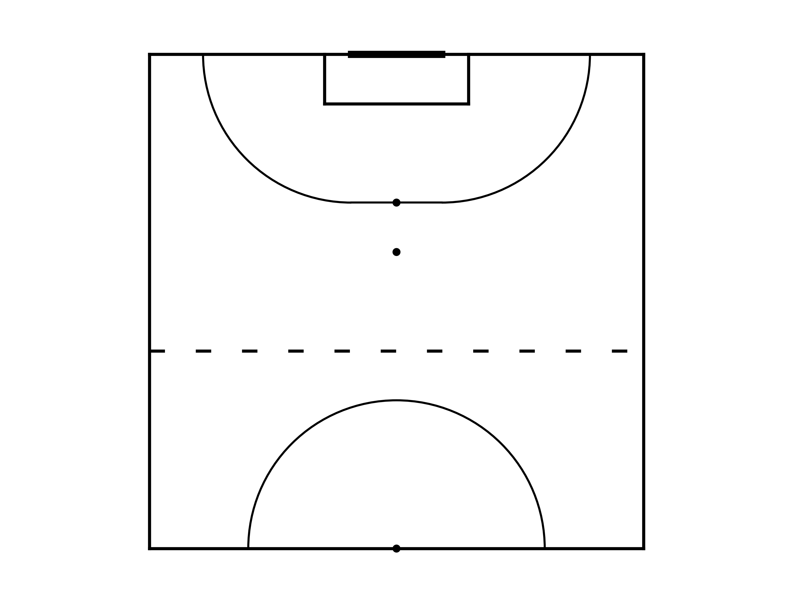

# Blind Football Pitch

This script generates a tactical representation of a blind football pitch using the Matplotlib library. It was inspired by the [mpl.soccer](https://mplsoccer.readthedocs.io/en/latest/) library.

The pitch measures 40 meters by 20 meters and is divided into thirds. It includes features such as the outline, center circle, penalty spots, goalkeeper, and penalty areas. The goalposts have dimensions of 3.66 meters in width and 2.14 meters in height.

## Usage

The `BFpitch` function takes two optional parameters: 'orientation' to determine the pitch orientation and 'half_pitch' to use only one of the halves or not.

- `orientation`:
    - `'horizontal'` for a horizontal pitch.
        - `half_pitch=True` for only the right half.
    - `'vertical'` for a vertical pitch.
        - `half_pitch=True` for only the upper half.

### Examples

```python
from blindfootballpitch import BFpitch
import matplotlib.pyplot as plt

# Generate a full horizontal pitch (default)
pitch = BFpitch()
pitch.draw()
plt.show()

# Generate the right half of the pitch
pitch = BFpitch()
pitch.draw(orientation='horizontal', half_pitch=True)
plt.show()

# Generate a vertical pitch
pitch = BFpitch()
pitch.draw(orientation='vertical')
plt.show()

# Generate the upper half of the pitch
pitch = BFpitch()
pitch.draw(orientation='vertical', half_pitch=True)
plt.show()
```

### Pitch Orientations
#### Horizontal Pitch ('h')


#### Right Half Pitch ('r')


#### Vertical Pitch ('v')


#### Upper Half Pitch ('u')


### Blind Football Maps

`blindfootball_maps.ipynb` is a guide to generate some maps using data from the WGP 2022 match.

- Attack Map
- Pass Map
- Heat Map

## Author

- Agustín Germán Rojas
- Email: agustingermanrojas@gmail.com

## License

This script is open-source and free to use. Feel free to modify this script for your specific needs
